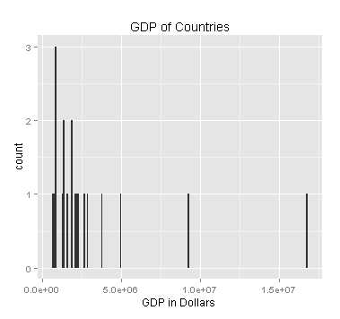

We are curious if there's a relationship between the value of a country's currency compared to the US as a gold standard and the country's economy measured by GDP.  The country's ranking is included to help visualize the country's economy compared to the rest of the world. 


```{r}
# Loads the datawrangling and visualizations with examples of inner join, outer join, and combining data sets
source("../02 Data Wrangling/inner.R", echo = TRUE)
```

After Joining birth rate with populations of countries, we attempted to group the countries into regions and then averaging the birth rate's of those regions to see if there is a relationship between birth rates. 

```{r}
#loads data frames along with the needed library functions and prints out
source("../02 Data Wrangling/outer.R", echo = TRUE)
```

Combined literacy rates and a country's GDP to see if there's a correlation.
```{r}
# Loads the datawrangling and visualizations with examples of inner join, outer join, and combining data sets
source("../02 Data Wrangling/combine.R", echo = TRUE)
```


```{r}
# externally call the PNG files for the histogram and the bar graph to display categorical variables
#source("../03 Visualizations/png.R", echo = TRUE)
```

    
